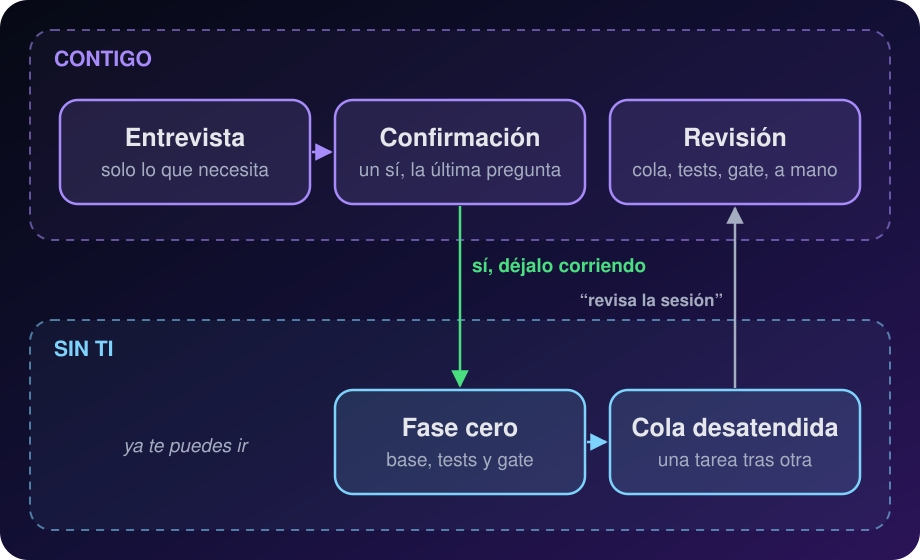
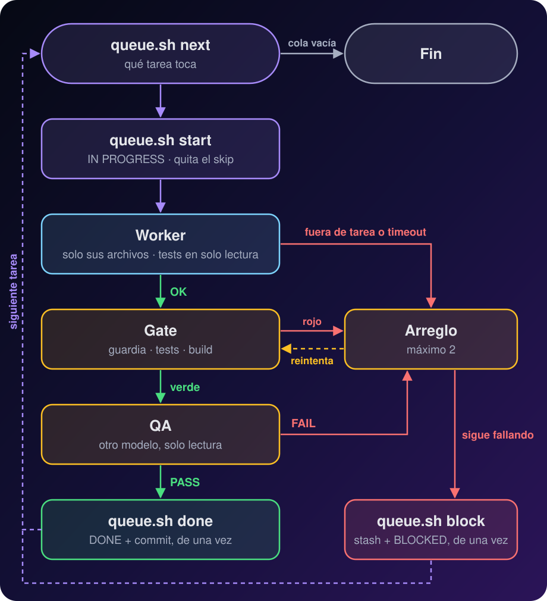

<p align="center">
  <a href="README.md">English</a> · <b>Español</b>
</p>

<p align="center">
  
</p>

<h3 align="center">
  Le cuentas una idea a tu agente. Te hace las preguntas justas, monta el proyecto<br/>
  y deja a un equipo de agentes sacándolo adelante mientras tú haces otra cosa.
</h3>

<p align="center">
  <a href="CHANGELOG.es.md"></a>
  
  <a href="https://github.com/Aresdgi/unattended-dev/actions/workflows/test.yml"></a>
  <a href="#licencia"></a>
  <br/>
  
  
  
  
</p>

<p align="center">
  
  <br/>
  <sub>Sesión de ejemplo</sub>
</p>

> [!WARNING]
> **Experimental.** Los scripts tienen tests en Linux y macOS (mira
> [Tests](#-tests)), pero las ejecuciones desatendidas completas solo se han
> probado en unos pocos proyectos pequeños. Revisa lo que construye antes de
> fiarte.

> [!NOTE]
> **Antes se llamaba `modo-desatendido`** y vivía en el marketplace
> `aresdgi`. Si lo tenías instalado así, se pasa solo al nombre nuevo: en
> Claude Code ejecuta una vez
>
> ```text
> /plugin marketplace update aresdgi
> /plugin install unattended-dev@aresdgi
> ```

## 🚀 Pruébalo en 10 segundos

**Claude Code**

```text
/plugin marketplace add Aresdgi/unattended-dev
/plugin install unattended-dev@unattended-dev
```

**Codex, opencode y otros agentes**

```sh
npx skills add Aresdgi/unattended-dev -g -a codex opencode
```

**O deja que lo haga tu agente.** Pega esto en Claude Code, Codex, opencode o
cualquier agente con terminal:

```text
Instala la skill unattended-dev de https://github.com/Aresdgi/unattended-dev
```

Y luego, sin más: *"quiero hacer…"*. Más opciones en [Instalación](#-instalación).

## 💜 Por qué mola

<table>
<tr>
<td width="50%" valign="top">

### 🧠 Una entrevista que no deja huecos

Te pregunta solo lo necesario, con opciones y su recomendación primero. Lo
que te da igual lo decide y lo marca *"(por defecto)"*.

</td>
<td width="50%" valign="top">

### 🛡️ Tests difíciles de trucar

Los escribe quien no implementa, los workers los reciben en solo lectura y
una guardia en el gate caza las trampas habituales: cambiar una
comprobación, volver a poner un skip o borrar un test.

</td>
</tr>
<tr>
<td valign="top">

### 🎛️ Tu equipo, tus modelos

Claude, Codex, opencode… Solo te ofrece lo que tienes instalado, y tú
eliges quién orquesta, quién implementa y quién revisa.

</td>
<td valign="top">

### 🌙 Se lanza solo

Le dices "sí" y deja al orquestador trabajando en segundo plano, con el
Mac despierto. No tienes que abrir ninguna terminal.

</td>
</tr>
<tr>
<td valign="top">

### 🔁 Si se corta, sigue

Todo el estado vive en archivos. Si se acaba la cuota o se duerme el
portátil, se relanza y retoma donde se quedó.

</td>
<td valign="top">

### 🔒 Nada irreversible sin ti

Push, despliegues, borrados y datos reales quedan fuera de la cola. Eso
se hace contigo delante.

</td>
</tr>
<tr>
<td valign="top">

### 🧭 No se para en cada duda

Antes de lanzar, otro modelo busca huecos en la SPEC y los resolvéis en una
ronda. Si aun así aparece uno de noche, elige la opción más prudente, la
apunta en `docs/DECISIONES.md` y sigue.

</td>
<td valign="top">

### 🗒️ Todo queda apuntado

Los inicios, arreglos, decisiones y bloqueos van solos al Log de
`STATUS.md`, y el orquestador te informa en tu idioma.

</td>
</tr>
</table>

> [!TIP]
> Lo que funciona no es la ceremonia. Son cuatro cosas: **tareas pequeñas y
> verificables**, **tests escritos antes y protegidos**, **una QA que no hace
> quien implementa** y **el estado en archivos** para poder retomar. Todo lo
> demás, lo mínimo.

## 🧭 Cómo funciona

<p align="center">
  
</p>

| | Fase | Qué pasa |
| :-: | --- | --- |
| 1 | **Entrevista** | Como mucho 4 preguntas por ronda, con opciones y una recomendación. Termina con un resumen y "¿lo armo así?" |
| 2 | **Plan y equipo** | Tareas pequeñas con sus archivos cerrados. Inventario de lo instalado y un papel para cada herramienta |
| 3 | **Fase cero** | Esqueleto, gate, tests de aceptación en skip, `AGENTS.md`, `ORQUESTADOR.md` y prueba de humo de todo el equipo |
| 4 | **Lanzamiento** | Te pregunta "¿lo lanzo yo?". Con un sí, hace una prueba en seco y deja al orquestador en segundo plano, en una sesión nueva con el contexto limpio |
| 5 | **Revisión** | Al volver, dices "revisa la sesión": comprueba la cola, la guardia, el gate y una prueba a mano |

### Cada tarea de la cola

El orquestador **coordina, no implementa**: trabaja con lo que le devuelven
los scripts, no con el código. Única excepción: tras dos arreglos fallidos
puede leer el test que falla y la función que prueba, para decidir entre
bloquear la tarea o dar una orden más clara.

<p align="center">
  
</p>

- **Gate**: guardia de tests, typecheck, tests y build, en
  `.desatendido/gate.sh`. `queue.sh done` lo ejecuta él mismo antes de cerrar.
- **QA**: en solo lectura, una por tipo. *Fidelidad* (hace lo que pide la
  SPEC, nada inventado), *técnica* (errores, casos límite, seguridad) y
  *diseño* (capturas en móvil y escritorio, estados vacío y error,
  accesibilidad).

Si la sesión se corta (cuota, portátil dormido…), se vuelve a lanzar igual:
lo que quedó a medias de la tarea IN PROGRESS se guarda en una rama de
copia y esa tarea vuelve a empezar desde limpio.

## 🌙 Lanzamiento automático

Al terminar la fase cero te pregunta **"¿lo lanzo yo?"**. Con un sí elige el
mecanismo según el orquestador, hace una **prueba en seco** con un objetivo
trivial (el orquestador lanzado arranca un worker de prueba y lo libera, para
probar la cadena entera) y solo entonces lanza de verdad.

| Orquestador | Cómo lo lanza | Cómo mirarlo | Cómo pararlo |
| --- | --- | --- | --- |
| **Claude Code** | `claude --bg` con el modelo, el modo de permisos y el `/goal` | `claude agents`, `claude attach <id>`, `claude logs <id>` | `claude stop <id>` |
| **Con `/goal` sin segundo plano** (Codex) | Sesión de tmux en segundo plano y el `/goal` con `tmux send-keys` | `tmux attach -t ud-<proyecto>` | `tmux kill-session -t ud-<proyecto>` |
| **Sin `/goal`** | `.desatendido/bucle.sh` con `nohup` | `tail -f logs/bucle-*.log` | `touch AGENT_STOP` |
| **Workers con Orca** | Pestaña de Orca con `orca terminal create` | La pestaña en Orca | `orca terminal close` |

- Siempre con **`caffeinate`** para que el Mac no se duerma mientras dure.
  Déjalo enchufado: con batería y la tapa cerrada se dormirá igual.
- El `/goal` solo pide un **estado final**: la cola sin tareas PENDING y
  el gate en verde, que el orquestador haya tenido que parar y diga por
  qué, o que se acaben las horas que elegiste. Los fallos por el camino
  van al informe final y nunca lo dejan dando vueltas.
- Un **fusible de tiempo** para la sesión al acabar esas horas aunque el
  goal no termine nunca. Si dices "sin límite", queda como red de
  seguridad a las 24 horas.
- Si tmux no está instalado, **te pide permiso** antes de instalarlo.
- El CLI de Orca solo funciona dentro de una terminal de Orca. Por eso, si
  los workers van con Orca, el orquestador arranca en una pestaña de Orca.
  Si no se puede usar Orca, **para y te pregunta**; nunca cambia de lanzador
  por su cuenta.
- Si prefieres lanzarlo tú, dile que no y te da `LANZAR.md` rellenado.

## ⚡ Dos modos

| | 🏎️ Rápido · *por defecto* | 🏗️ Completo |
| --- | --- | --- |
| **Cuándo** | 6 tareas o menos y nada arriesgado | Proyecto grande, datos reales, alto riesgo o porque lo pides |
| **Entrevista** | 1 o 2 rondas | Las que hagan falta |
| **Aprobaciones** | Una, al final de la preparación | Al final de cada fase |
| **Documentos** | `docs/SPEC.md` y `PLAN.md` | SPEC, una tarea por archivo y un cierre por tarea |
| **Fase cero** | Unos 15 minutos | Entre 30 y 60 minutos |

Al terminar la entrevista te propone uno, en una línea y con el motivo.

## 🎛️ Tu equipo, tus reglas

No hay equipo fijo. Antes de preguntar, la skill mira qué tienes instalado
(Claude Code, Codex, opencode, Gemini, Orca, tmux…), qué modelos acepta cada
uno y si tiene `/goal` y modo en segundo plano, y **solo te ofrece eso**.

| Papel | Qué hace |
| --- | --- |
| 🎼 **Orquestador** | Reparte la cola (con `queue.sh`, que es quien lleva `STATUS.md`), pasa el gate y decide los arreglos |
| 🛠️ **Implementa** | Hace cada tarea y sus arreglos |
| 🎨 **Diseño** | Las tareas de interfaz, si las hay. Puede ser el mismo que implementa |
| 🔍 **QA** | Revisa en solo lectura. Mejor de un proveedor distinto al que implementa |

Cada papel lo ocupa la herramienta y el modelo que digas, aunque no sea lo
más eficiente: te avisa una vez con el motivo (QA con el mismo modelo que
implementa, un modelo caro en tareas mecánicas, todo el equipo tirando de la
misma cuota…) y hace lo que digas.

Si quieres, lo guarda como "el de siempre" en
`~/.config/modo-desatendido/equipo.md`, y la próxima vez es la primera opción:

```markdown
- Orchestrator: claude / opus
- Implements: opencode / <proveedor/modelo>
- Design: same as implements
- QA: codex / <modelo>
- Worker launcher: cli
```

Antes de lanzar, **prueba de humo**: cada papel responde
`OK <nombre exacto del modelo>` y no se lanza nada hasta que todos estén en verde.

La skill habla siempre en tu idioma, aunque sus archivos estén en inglés.

## 🧰 Scripts incluidos

La fase cero copia cinco scripts a `.desatendido/` en tu proyecto.
Funcionan con cualquier herramienta y en macOS sin instalar nada. Detectan
los problemas después de que ocurran y toman las decisiones mecánicas; no
son un entorno aislado.

<table>
<tr>
<td width="25%" valign="top">

#### 🚀 `lanzar-worker.sh`

Lanza cualquier worker con **límite de tiempo**, **registro completo** en
`logs/` y solo las últimas 30 líneas de salida. Puede dejar los tests en
**solo lectura** mientras trabaja y avisa de cualquier archivo tocado fuera
de su tarea, **con commit o sin él**.

</td>
<td width="25%" valign="top">

#### 🛡️ `guardia-tests.sh`

Va dentro del gate. **Falla** si alguien cambia un test de aceptación en
algo más que quitar el skip, añade un skip nuevo, borra o crea tests, o
da por hecha una tarea que aún tiene su test en skip.

</td>
<td width="25%" valign="top">

#### 📋 `queue.sh`

Toma las **decisiones mecánicas** con código, no con el modelo: la
siguiente tarea, las dependencias, propagar los BLOCKED, quitar el skip al
empezar una tarea, **cerrar** una tarea en un solo paso atómico y
**recuperar** una tarea que se cortó. Cada tarea se mide contra el commit
del que partió: `done` se niega si tocó archivos fuera de su lista, si el
gate falla o si no hay QA PASS para el código exacto que se cierra. Cada
cambio de estado lleva su commit.

</td>
<td width="25%" valign="top">

#### 🔁 `bucle.sh`

Mantiene vivo al orquestador si su herramienta no tiene objetivo nativo:
una tarea por vuelta, elegida por `queue.sh`, con el contexto limpio, hasta
vaciar la cola o llegar al límite de horas. Una vuelta que se cuelga se corta.

</td>
</tr>
</table>

Y **`vigilar-worker.sh`**: las mismas protecciones que `lanzar-worker.sh`
(tests y `.desatendido/` en solo lectura, archivos tocados fuera de la tarea) en dos pasos,
`begin` y `end`, para workers que arrancan y terminan por su cuenta, como
los de Orca.

<details>
<summary><b>Uso y códigos de salida</b></summary>

```zsh
# La cola: siguiente tarea, empezarla (quita el skip de su test) y cerrarla
.desatendido/queue.sh next            # -> T01
.desatendido/queue.sh start T01
.desatendido/queue.sh qa T01 fidelity PASS "resumen"  # veredicto de QA para el código tal como está
.desatendido/queue.sh done T01 "resumen"   # comprueba, y DONE + commit, de una vez
.desatendido/queue.sh block T01 "motivo"   # rama de copia + archivos de vuelta + BLOCKED, de una vez
.desatendido/queue.sh fix T01 "motivo"     # cuenta un arreglo; sale con 5 si no quedan
.desatendido/queue.sh decide T01 "regla"   # apunta una decisión por defecto, +1 arreglo
.desatendido/queue.sh note "texto"         # una línea libre en el Log
.desatendido/queue.sh outside T01          # archivos fuera de la tarea desde que empezó
.desatendido/queue.sh restore-outside T01  # los devuelve (queda una copia en una rama)

# Un worker, con sus archivos permitidos y los tests en solo lectura
.desatendido/lanzar-worker.sh implements T01 \
  --allowed "src/dni.ts" --readonly "tests/acceptance" -- \
  opencode run -m <proveedor/modelo> "Implement task T01 of PLAN.md…"

# El gate (.desatendido/gate.sh) empieza con la guardia, vigilando las tareas empezadas y DONE
.desatendido/guardia-tests.sh fase-cero tests/acceptance $(.desatendido/queue.sh tests) \
  && npm run typecheck && npm test && npm run build

# El bucle externo: máximo 4 horas, 1 hora por vuelta, y parada limpia
MAX_HOURS=4 ROUND_TIMEOUT=3600 .desatendido/bucle.sh
touch AGENT_STOP   # para al terminar la vuelta en curso
```

| `lanzar-worker.sh` sale con | Significa |
| :-: | --- |
| `0` | Terminó bien y no tocó nada fuera de lo permitido |
| `3` | **OUT OF TASK**: tocó archivos no permitidos |
| `124` | **TIMEOUT**: superó el límite (20 minutos por defecto) |
| `128+N` | **KILLED**: el worker se paró por la señal N |

| `queue.sh` sale con | Significa |
| :-: | --- |
| `3` | Uso o estado incorrecto: por ejemplo `start` con una dependencia que no está DONE u otra tarea IN PROGRESS |
| `4` | Falló un paso de git; no se marcó nada |
| `5` | No quedan arreglos ni decisiones: hay que bloquear la tarea |
| `6` | Archivos fuera de la tarea desde que empezó (`outside`, `done`). También `fix`, `decide`, `note`, `qa` y `set` si `STATUS.md` tiene cambios que no hizo `queue.sh` |
| `7` | `done`: el gate falló (imprime las últimas 20 líneas) o cambió archivos (se devuelven a su estado) |
| `8` | `done`: falta un QA PASS de algún tipo para el código tal como está |

Los commits de `queue.sh` que solo llevan `STATUS.md` o
`docs/DECISIONES.md` (`start`, `fix`, `decide`, `note`, `qa`, `set`) se
saltan los hooks de git del proyecto (`--no-verify`). `done`, `block`,
`recover` y `restore-outside` llevan código y los ejecutan.

`bucle.sh` recupera cualquier tarea que se quedara IN PROGRESS antes de
empezar, y se para solo si la cola se vacía, si ninguna tarea puede
empezar, si existe `AGENT_STOP`, si se pasa de `MAX_ROUNDS` o `MAX_HOURS`,
o si una vuelta termina sin que su tarea quede DONE o BLOCKED. Una vuelta
que pasa de `ROUND_TIMEOUT` (o del tiempo que quede de `MAX_HOURS`) se
corta, su tarea vuelve a PENDING y el bucle se para con 124.

</details>

## 🧪 Tests

Los scripts tienen su propia batería de tests, que se ejecuta en Linux y
macOS con cada push:

```zsh
bash tests/run.sh
```

Cubre las trampas encontradas en la revisión (una comprobación borrada junto
a un skip, un archivo prohibido modificado y con commit, un worker matado
por una señal), la recuperación de la cola cuando se corta una sesión, que
el estado de la cola sobreviva a un bloqueo o a un paso de git que falla, y
que tus propios cambios nunca acaben dentro de una tarea. También un cambio
fuera de tarea que sobrevive a un arreglo, un worker que hace commit de
código roto antes de un bloqueo, un `done` sin gate ni QA, un QA PASS para
código que cambió después y una vuelta que se cuelga.

## 📁 Lo que deja en tu proyecto

```text
mi-proyecto/
├── .desatendido/            scripts de arriba, gate.sh y los archivos permitidos de cada tarea
├── docs/
│   ├── SPEC.md              1 o 2 páginas: qué hace, entradas, errores, límites
│   ├── tareas/Txx.md        solo en modo completo
│   └── cierres/             solo en modo completo
├── tests/acceptance/        uno por tarea, en skip, escritos por quien no implementa
├── AGENTS.md                convenciones (CLAUDE.md es un enlace a él)
├── ORQUESTADOR.md           reglas y comandos reales de cada papel
├── PLAN.md                  tareas con firma, archivos permitidos y casos
└── STATUS.md                la cola: PENDING · IN PROGRESS · DONE · BLOCKED
```

Todo queda en un commit `fase cero` con el tag `fase-cero`, que es la
referencia contra la que la guardia compara los tests. Durante la cola, el
trabajo de una tarea bloqueada o interrumpida se guarda en una rama
`queue/backup/<tarea>-<fecha>`.

## 🔒 Reglas de seguridad

Valen siempre, sea cual sea el equipo o el modo:

> [!IMPORTANT]
> - **Nada irreversible en la cola.** Datos reales, borrados, despliegues,
>   publicar o push se hacen contigo delante.
> - **Sin red de seguridad no hay lanzamiento.** Hacen falta tests de
>   aceptación verificados, la guardia en el gate, la prueba de humo en verde
>   y la prueba en seco del lanzamiento superada.
> - **Nada se decide en silencio.** Los huecos que aparecen al preparar se
>   preguntan. Los que aparecen durante la cola siguen la autonomía que
>   elegiste: *proactiva* (por defecto) apunta una regla prudente en
>   `docs/DECISIONES.md` y sigue, *conservadora* bloquea la tarea con la
>   pregunta. Lo que cambie lo que hace el producto siempre te lo deja a ti.
> - **Las credenciales nunca entran en la cola**, ni `.env`, claves o logs
>   en los commits.
> - **La cola solo hace commit de su propio trabajo.** Una tarea no empieza
>   si la carpeta tiene cambios que no son de la cola. Para seguir
>   trabajando en el repo mientras tanto, usa un worktree tuyo
>   (`git worktree add`).

## 📦 Instalación

### Claude Code

```text
/plugin marketplace add Aresdgi/unattended-dev
/plugin install unattended-dev@unattended-dev
```

Para actualizar: `/plugin marketplace update unattended-dev`. También está en mi
catálogo de plugins, [Aresdgi/claude-plugins](https://github.com/Aresdgi/claude-plugins),
como `unattended-dev@aresdgi`.

### Codex, opencode y otros agentes

Con [skills](https://www.npmjs.com/package/skills), que encuentra la skill
en `skills/unattended-dev`:

```sh
npx skills add Aresdgi/unattended-dev -g -a codex opencode
```

`-g` la instala para tu usuario y `-a` elige los agentes (`-a '*'` para
todos los que soporta). Para actualizar: `npx skills update unattended-dev`.

<details>
<summary><b>A mano, con git</b></summary>

<br/>

```sh
git clone https://github.com/Aresdgi/unattended-dev.git ~/unattended-dev
mkdir -p ~/.agents/skills
ln -s ~/unattended-dev/skills/unattended-dev ~/.agents/skills/unattended-dev
```

Para actualizar: `git -C ~/unattended-dev pull`.

</details>

### 🤖 Para agentes

Si un usuario te ha pedido instalar esta skill, sigue estos pasos según la
herramienta en la que estés. Pide permiso antes de ejecutar nada si tus
permisos lo exigen.

1. **Claude Code**: ejecuta en la terminal
   ```sh
   claude plugin marketplace add Aresdgi/unattended-dev
   claude plugin install unattended-dev@unattended-dev
   ```
   Después dile al usuario que ejecute `/reload-plugins` o abra una sesión
   nueva.
2. **Codex, opencode u otro agente, con Node.js disponible**: ejecuta
   ```sh
   npx skills add Aresdgi/unattended-dev -g -a <agente> -y
   ```
   donde `<agente>` es `codex`, `opencode` o el tuyo (`-a '*'` para todos
   los que soporta).
3. **Sin Node.js**: clona el repo y enlaza la carpeta de la skill en la
   carpeta de skills que lea tu herramienta (`~/.agents/skills` para Codex y
   opencode, `~/.claude/skills` para Claude Code):
   ```sh
   git clone https://github.com/Aresdgi/unattended-dev.git ~/unattended-dev
   mkdir -p ~/.agents/skills
   ln -s ~/unattended-dev/skills/unattended-dev ~/.agents/skills/unattended-dev
   ```

Comprueba que `SKILL.md` está en la carpeta instalada y dile al usuario que
ya está lista y que una sesión nueva la carga. Se activa con "quiero
hacer…" o "modo desatendido".

> [!TIP]
> Funciona en cualquier agente que lea `SKILL.md`. Si tu herramienta tiene
> preguntas con opciones, las usa; si no, te da opciones numeradas.

## 💬 Cómo se usa

Habla normal, en español o en inglés. Se activa con frases como:

> *"quiero hacer…"* · *"monta el proyecto"* · *"prepáralo para que se haga solo"*
> · *"modo desatendido"* · *"modo nocturno"* · *"déjalo picando"* · *"lánzalo"*

En Claude Code también puedes llamarla directamente con
`/unattended-dev:unattended-dev`.

Cuando vuelvas, en la misma sesión donde lo preparaste, di **"revisa la
sesión"**: comprueba el estado de la cola, que los tests sigan intactos, el
gate, una prueba a mano con resultados conocidos y te deja una tabla con
tareas hechas, fallos de QA, duración y uso de cada plan.

<details>
<summary><b>¿Y en un repo que ya existe?</b></summary>

<br/>

Igual, pero la entrevista solo cubre el hito, no se crea esqueleto y el tag
es `<hito>-start`. Si ya hay una SPEC general, la del hito va en
`docs/hitos/<hito>/`. Si encuentra restos de versiones antiguas
(`desatendido.sh`, `DESATENDIDO.md`, un `bucle.sh` en la raíz), te propone
borrarlos y espera tu OK.

</details>

<details>
<summary><b>¿Qué pasa si una tarea no sale?</b></summary>

<br/>

Tiene dos intentos de arreglo, que cuenta `queue.sh`. Si el problema es un
hueco de la SPEC y la autonomía es proactiva, apunta una regla prudente en
`docs/DECISIONES.md`, que le da un arreglo más. Si sigue fallando, queda
**BLOCKED** con el motivo en el Log, su trabajo se guarda en una rama
`queue/backup/` (sus archivos vuelven a como estaban antes de la tarea,
incluso lo que el worker llegó a commitear) y el orquestador sigue con la
siguiente. Las tareas que
dependían de ella también quedan bloqueadas. En la revisión repasáis
primero las decisiones, y te propone si arreglar la tarea, la SPEC o los
tests, con supervisión.

</details>

<details>
<summary><b>¿Puede el orquestador cambiar los tests para que pasen?</b></summary>

<br/>

Lo tiene prohibido, y además se lo ponemos difícil: los workers reciben los
tests y los scripts de `.desatendido/` en solo lectura, quien quita el skip
es `queue.sh` y la guardia revisa cada gate, así que cambiar una
comprobación, añadir un skip o borrar un test lo tumba. Un QA PASS solo
vale para el código que revisó, y `queue.sh done` ejecuta el gate él
mismo. Los scripts cazan las trampas habituales, pero no son un
entorno aislado; por eso la revisión final vuelve a comprobar los tests.

</details>

<details>
<summary><b>¿Necesito Orca o tmux?</b></summary>

<br/>

No. Por defecto los workers se lanzan por CLI con `lanzar-worker.sh`, y con
Claude Code como orquestador basta `claude --bg`. Orca es opcional, si
quieres ver cada worker en su propia pestaña. En ese modo el orquestador
sigue la guía de orquestación del propio Orca, reutiliza la pestaña del
implementador para los arreglos, cierra cada pestaña con `worker-release` en
cuanto deja de hacer falta y comprueba al final que no queda ninguna, con
las mismas protecciones que por CLI (`vigilar-worker.sh`). tmux solo hace
falta si el orquestador tiene `/goal` pero no modo en segundo plano, como
Codex.

</details>

## 📜 Cambios

Lo que cambió en cada versión, desde la primera (como `modo-nocturno`),
está en [CHANGELOG.es.md](CHANGELOG.es.md). Cada versión pública tiene
además su [release](https://github.com/Aresdgi/unattended-dev/releases): en
GitHub, **Watch → Custom → Releases** para que te avise de las nuevas.

## Licencia

MIT

<div align="center">
<sub>Hecho por <a href="https://github.com/Aresdgi">Aresdgi</a> · para dejarlo picando 🌙</sub>
</div>
