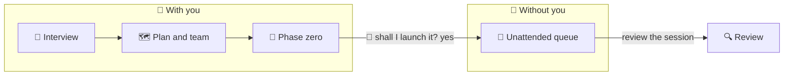
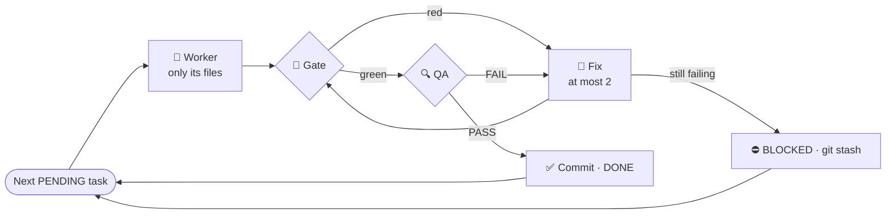

<p align="center">
  <b>English</b> · <a href="README.es.md">Español</a>
</p>

<p align="center">
  
</p>

<h3 align="center">
  Tell your agent an idea. It asks just the right questions, sets up the project<br/>
  and leaves a team of agents building it while you do something else.
</h3>

<p align="center">
  <a href="https://github.com/Aresdgi/unattended-dev"></a>
  
  <a href="https://github.com/Aresdgi/unattended-dev/actions/workflows/test.yml"></a>
  <a href="#license"></a>
  <br/>
  
  
  
  
</p>

<p align="center">
  
  <br/>
  <sub>Example session</sub>
</p>

> [!WARNING]
> **Experimental.** The scripts are tested on Linux and macOS (see
> [Testing](#-testing)), but full unattended runs have only been tried on a
> few small projects. Review what it builds before you trust it.

> [!NOTE]
> **Formerly `modo-desatendido`**, in the `aresdgi` marketplace. If you
> installed it that way, it moves to the new name by itself: in Claude
> Code run once
>
> ```text
> /plugin marketplace update aresdgi
> /plugin install unattended-dev@aresdgi
> ```

## 🚀 Try it in 10 seconds

**Claude Code**

```text
/plugin marketplace add Aresdgi/unattended-dev
/plugin install unattended-dev@unattended-dev
```

**Codex, opencode and other agents**

```sh
npx skills add Aresdgi/unattended-dev -g -a codex opencode
```

**Or let your agent do it.** Paste this into Claude Code, Codex, opencode or
any agent with a terminal:

```text
Install the unattended-dev skill from https://github.com/Aresdgi/unattended-dev
```

Then just say: *"I want to build…"*. More options in [Installation](#-installation).

## 💜 Why it's good

<table>
<tr>
<td width="50%" valign="top">

### 🧠 An interview that leaves no gaps

It only asks what it needs, with options and its recommendation first.
Whatever you don't care about, it decides and marks *"(default)"*.

</td>
<td width="50%" valign="top">

### 🛡️ Tests that are hard to cheat

They are written by someone who doesn't implement, workers get them
read-only, and a guard in the gate catches the usual tricks: changing an
assertion, re-adding a skip, deleting a test.

</td>
</tr>
<tr>
<td valign="top">

### 🎛️ Your team, your models

Claude, Codex, opencode… It only offers what you have installed, and you
choose who orchestrates, who implements and who reviews.

</td>
<td valign="top">

### 🌙 It launches itself

Say "yes" and it leaves the orchestrator working in the background, with
the Mac kept awake. You don't open a single terminal.

</td>
</tr>
<tr>
<td valign="top">

### 🔁 If it stops, it resumes

All the state lives in files. If the quota runs out or the laptop goes to
sleep, relaunch it and it picks up where it left off.

</td>
<td valign="top">

### 🔒 Nothing irreversible without you

Push, deployments, deletions and real data stay out of the queue. Those
are done with you watching.

</td>
</tr>
</table>

> [!TIP]
> What works is not ceremony. It's four things: **small verifiable tasks**,
> **tests written first and protected**, **QA not done by whoever
> implemented** and **state kept in files** so work can resume. Everything
> else, the minimum.

## 🧭 How it works



| | Phase | What happens |
| :-: | --- | --- |
| 1 | **Interview** | At most 4 questions per round, with options and a recommendation. Ends with a summary and "shall I set it up like this?" |
| 2 | **Plan and team** | Small tasks with closed file lists. Inventory of what's installed and a role for each tool |
| 3 | **Phase zero** | Skeleton, gate, skipped acceptance tests, `AGENTS.md`, `ORQUESTADOR.md` and a smoke test of the whole team |
| 4 | **Launch** | Asks "shall I launch it?". With a yes, it runs a dry run and leaves the orchestrator in the background, in a new session with a clean context |
| 5 | **Review** | When you're back, say "review the session": it checks the queue, the guard, the gate and a manual test |

### Each task in the queue

The orchestrator **coordinates, it doesn't implement**: it never reads code
or diffs, only what the scripts hand back.



- **Gate**: test guard, typecheck, tests and build.
- **QA**: read-only, one per type. *Fidelity* (does what the SPEC asks,
  nothing invented), *technical* (bugs, edge cases, security) and *design*
  (mobile and desktop screenshots, empty and error states, accessibility).

If the session gets cut off (quota, laptop asleep…), launch it again the
same way: the task left IN PROGRESS is stashed and resumed.

## 🌙 Automatic launch

When phase zero is done it asks **"shall I launch it?"**. With a yes, it
picks the mechanism for your orchestrator, runs a **dry run** with a trivial
goal (the launched orchestrator starts a test worker and releases it, to test
the whole chain) and only then launches for real.

| Orchestrator | How it launches | How to watch | How to stop |
| --- | --- | --- | --- |
| **Claude Code** | `claude --bg` with the model, the permission mode and the `/goal` | `claude agents`, `claude attach <id>`, `claude logs <id>` | `claude stop <id>` |
| **`/goal` but no background mode** (Codex) | Detached tmux session, `/goal` typed with `tmux send-keys` | `tmux attach -t ud-<project>` | `tmux kill-session -t ud-<project>` |
| **No `/goal`** | `.desatendido/bucle.sh` with `nohup` | `tail -f logs/bucle-*.log` | `touch AGENT_STOP` |
| **Workers through Orca** | Orca tab with `orca terminal create` | The tab in Orca | `orca terminal close` |

- Always with **`caffeinate`** so the Mac doesn't sleep while it runs. Keep
  it plugged in: on battery with the lid closed it will sleep anyway.
- If tmux isn't installed, it **asks for permission** before installing it.
- The Orca CLI only works inside an Orca terminal. So if the workers go
  through Orca, the orchestrator starts in an Orca tab; if that's not
  possible, it warns you and proposes the CLI worker launcher, which
  doesn't depend on Orca.
- If you'd rather launch it yourself, say no and you get `LANZAR.md` filled
  in.

## ⚡ Two modes

| | 🏎️ Fast · *default* | 🏗️ Full |
| --- | --- | --- |
| **When** | 6 tasks or fewer and nothing risky | Large project, real data, high risk or because you ask |
| **Interview** | 1 or 2 rounds | As many as needed |
| **Approvals** | One, at the end of the preparation | At the end of each phase |
| **Documents** | `docs/SPEC.md` and `PLAN.md` | SPEC, one file per task and one closing note per task |
| **Phase zero** | About 15 minutes | Between 30 and 60 minutes |

When the interview ends it proposes one, in one line and with the reason.

## 🎛️ Your team, your rules

There's no fixed team. Before asking, the skill checks what you have
installed (Claude Code, Codex, opencode, Gemini, Orca, tmux…), which models
each one accepts and whether it has `/goal` and a background mode, and
**only offers that**.

| Role | What it does |
| --- | --- |
| 🎼 **Orchestrator** | Hands out the queue, runs the gate, decides fixes and keeps `STATUS.md` |
| 🛠️ **Implements** | Does each task and its fixes |
| 🎨 **Design** | The UI tasks, if any. Can be the same as implements |
| 🔍 **QA** | Reviews read-only. Ideally a different provider from the implementer |

Each role is taken by the tool and model you say, even if it's not the most
efficient: it warns you once with the reason (QA with the same model that
implements, an expensive model on mechanical tasks, the whole team on the
same quota…) and does what you say.

If you want, it saves it as "the usual" in
`~/.config/modo-desatendido/equipo.md`, and next time it's the first option:

```markdown
- Orchestrator: claude / opus
- Implements: opencode / <provider/model>
- Design: same as implements
- QA: codex / <model>
- Worker launcher: cli
```

Before launching, a **smoke test**: each role answers
`OK <exact model name>` and nothing launches until they're all green.

The skill always talks to you in your language.

## 🧰 Included scripts

Phase zero copies four scripts to `.desatendido/` in your project. They
work with any tool and on macOS without installing anything. They detect
problems after the fact and make the mechanical decisions; they are not a
sandbox.

<table>
<tr>
<td width="25%" valign="top">

#### 🚀 `lanzar-worker.sh`

Launches any worker with a **time limit**, a **full log** in `logs/` and
only the last 30 lines of output. Can make the tests **read-only** while it
runs, and flags any file touched outside its task, **committed or not**.

</td>
<td width="25%" valign="top">

#### 🛡️ `guardia-tests.sh`

Goes inside the gate. **Fails** if someone changes an acceptance test in
anything other than removing the skip, adds a new skip, deletes or creates
tests, or marks a task done while its test is still skipped.

</td>
<td width="25%" valign="top">

#### 📋 `queue.sh`

Makes the **mechanical decisions** in code, not in the model: the next
task, dependencies, BLOCKED propagation, removing the skip when a task
starts, **closing** a task in one atomic step and **recovering** a task
that was cut off. Every state change is committed, so a stash can never
undo it.

</td>
<td width="25%" valign="top">

#### 🔁 `bucle.sh`

Keeps the orchestrator alive if its tool has no native goal: one task per
round, chosen by `queue.sh`, with a clean context, until the queue is empty
or the hour limit is reached.

</td>
</tr>
</table>

<details>
<summary><b>Usage and exit codes</b></summary>

```zsh
# The queue: next task, start it (removes the skip of its test), finish it
.desatendido/queue.sh next            # -> T01
.desatendido/queue.sh start T01
.desatendido/queue.sh done T01 "summary"    # DONE + commit, in one step
.desatendido/queue.sh block T01 "reason"    # stash + BLOCKED, in one step

# A worker, with its allowed files and the tests read-only
.desatendido/lanzar-worker.sh implements T01 \
  --allowed "src/dni.ts" --readonly "tests/acceptance" -- \
  opencode run -m <provider/model> "Implement task T01 of PLAN.md…"

# The guard, at the start of the gate, watching the started and DONE tasks
.desatendido/guardia-tests.sh fase-cero tests/acceptance $(.desatendido/queue.sh tests) \
  && npm run typecheck && npm test && npm run build

# The external loop: 4 hours max and a clean stop
MAX_HOURS=4 .desatendido/bucle.sh
touch AGENT_STOP   # stops at the end of the current round
```

| `lanzar-worker.sh` exits with | Meaning |
| :-: | --- |
| `0` | Finished fine and touched nothing outside what's allowed |
| `3` | **OUT OF TASK**: touched files that weren't allowed |
| `124` | **TIMEOUT**: went over the limit (20 minutes by default) |
| `128+N` | **KILLED**: the worker was stopped by signal N |

`bucle.sh` recovers any task left IN PROGRESS before starting, and stops by
itself if the queue is empty, if no task can start, if `AGENT_STOP` exists,
if it goes over `MAX_ROUNDS` or `MAX_HOURS`, or if a round ends without its
task being DONE or BLOCKED.

</details>

## 🧪 Testing

The scripts have their own test suite, run on Linux and macOS on every push:

```zsh
bash tests/run.sh
```

It covers the cheats found in review (an assertion deleted together with a
skip, a forbidden file changed and committed, a worker killed by a signal)
queue recovery when a session is cut off, and the queue state surviving a
stash or a git step that fails.

## 📁 What it leaves in your project

```text
my-project/
├── .desatendido/            the scripts above
├── docs/
│   ├── SPEC.md              1 or 2 pages: what it does, inputs, errors, limits
│   ├── tareas/Txx.md        full mode only
│   └── cierres/             full mode only
├── tests/acceptance/        one per task, skipped, written by whoever doesn't implement
├── AGENTS.md                conventions (CLAUDE.md is a link to it)
├── ORQUESTADOR.md           rules and real commands for each role
├── PLAN.md                  tasks with signature, allowed files and cases
└── STATUS.md                the queue: PENDING · IN PROGRESS · DONE · BLOCKED
```

Everything goes into a `fase cero` commit with the `fase-cero` tag, which
is the reference the guard compares the tests against.

## 🔒 Safety rules

They always apply, whatever the team or the mode:

> [!IMPORTANT]
> - **Nothing irreversible in the queue.** Real data, deletions,
>   deployments, publishing or push are done with you watching.
> - **No safety net, no launch.** It needs verified acceptance tests, the
>   guard in the gate, a green smoke test and a passed launch dry run.
> - **Gaps get asked about.** If something is missing from the SPEC, the
>   skill asks you instead of filling it in silently.
> - **Credentials never go into the queue**, and no `.env`, keys or logs
>   in the commits.
> - **The queue only commits its own work.** A task won't start while the
>   folder has changes that aren't from the queue. To keep working on the
>   repo meanwhile, use a worktree of your own (`git worktree add`).

## 📦 Installation

### Claude Code

```text
/plugin marketplace add Aresdgi/unattended-dev
/plugin install unattended-dev@unattended-dev
```

To update: `/plugin marketplace update unattended-dev`. It is also in my plugin
catalog, [Aresdgi/claude-plugins](https://github.com/Aresdgi/claude-plugins), as
`unattended-dev@aresdgi`.

### Codex, opencode and other agents

With [skills](https://www.npmjs.com/package/skills), which finds the skill
in `skills/unattended-dev`:

```sh
npx skills add Aresdgi/unattended-dev -g -a codex opencode
```

`-g` installs it for your user and `-a` picks the agents (`-a '*'` for all
the supported ones). To update: `npx skills update unattended-dev`.

<details>
<summary><b>By hand, with git</b></summary>

<br/>

```sh
git clone https://github.com/Aresdgi/unattended-dev.git ~/unattended-dev
mkdir -p ~/.agents/skills
ln -s ~/unattended-dev/skills/unattended-dev ~/.agents/skills/unattended-dev
```

To update: `git -C ~/unattended-dev pull`.

</details>

### 🤖 For agents

If a user asked you to install this skill, follow these steps for the tool
you are running in. Ask before running anything if your permissions require
it.

1. **Claude Code**: run in the shell
   ```sh
   claude plugin marketplace add Aresdgi/unattended-dev
   claude plugin install unattended-dev@unattended-dev
   ```
   Then tell the user to run `/reload-plugins` or start a new session.
2. **Codex, opencode or another agent, with Node.js available**: run
   ```sh
   npx skills add Aresdgi/unattended-dev -g -a <agent> -y
   ```
   with `<agent>` being `codex`, `opencode` or your own id (`-a '*'` for
   every supported agent).
3. **Without Node.js**: clone the repo and link the skill folder into the
   skills directory your tool reads (`~/.agents/skills` for Codex and
   opencode, `~/.claude/skills` for Claude Code):
   ```sh
   git clone https://github.com/Aresdgi/unattended-dev.git ~/unattended-dev
   mkdir -p ~/.agents/skills
   ln -s ~/unattended-dev/skills/unattended-dev ~/.agents/skills/unattended-dev
   ```

Check that `SKILL.md` is in the installed folder, then tell the user it is
ready and that a new session picks it up. It triggers with "I want to
build…" or "unattended mode".

> [!TIP]
> Works in any agent that reads `SKILL.md`. If your tool has questions with
> options, it uses them; if not, it gives you numbered options.

## 💬 How to use it

Just talk, in English or Spanish. It triggers with phrases like:

> *"I want to build…"* · *"set up the project"* · *"make it build itself"*
> · *"unattended mode"* · *"overnight mode"* · *"leave it running"* · *"launch it"*
> · *"quiero hacer…"* · *"déjalo picando"*

In Claude Code you can also call it directly with
`/unattended-dev:unattended-dev`.

When you're back, in the same session where you prepared it, say **"review
the session"**: it checks the state of the queue, that the tests are still
intact, the gate and a manual test with known results, and leaves you a
table with tasks done, QA failures, duration and usage of each plan.

<details>
<summary><b>What about an existing repo?</b></summary>

<br/>

Same, but the interview only covers the milestone, no skeleton is created
and the tag is `<milestone>-start`. If there's already a general SPEC, the
milestone's goes in `docs/hitos/<milestone>/`. If it finds leftovers from
old versions (`desatendido.sh`, `DESATENDIDO.md`, a `bucle.sh` at the root),
it proposes deleting them and waits for your OK.

</details>

<details>
<summary><b>What if a task doesn't work out?</b></summary>

<br/>

It gets two fix attempts. If it still fails, it's marked **BLOCKED** with the
reason in `STATUS.md`, its changes are saved in a `git stash` and the
orchestrator moves on to the next one. Tasks that depended on it are blocked
too. In the review it proposes whether to fix the task, the SPEC or the
tests, supervised.

</details>

<details>
<summary><b>Can the orchestrator change the tests to make them pass?</b></summary>

<br/>

No. It's forbidden to touch the SPEC, the plan and the acceptance tests, and
the guard also checks it on every gate: any change other than removing the
skip of the current task fails the gate.

</details>

<details>
<summary><b>Do I need Orca or tmux?</b></summary>

<br/>

No. By default workers are launched through the CLI with `lanzar-worker.sh`,
and with Claude Code as the orchestrator `claude --bg` is enough. Orca is
optional, if you want to see each worker in its own tab. tmux is only needed
if the orchestrator has `/goal` but no background mode, like Codex.

</details>

## License

MIT

<div align="center">
<sub>Made by <a href="https://github.com/Aresdgi">Aresdgi</a> · to leave it running 🌙</sub>
</div>
