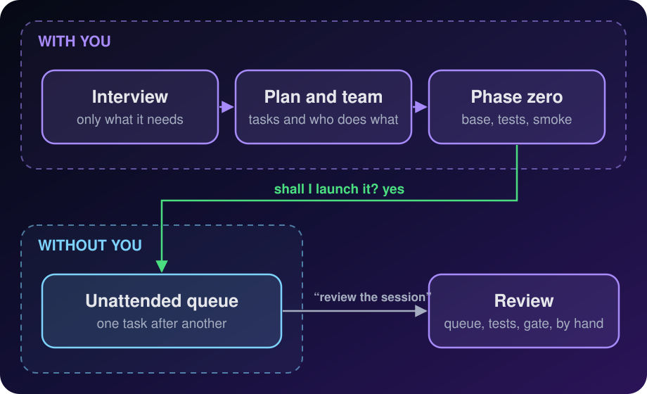
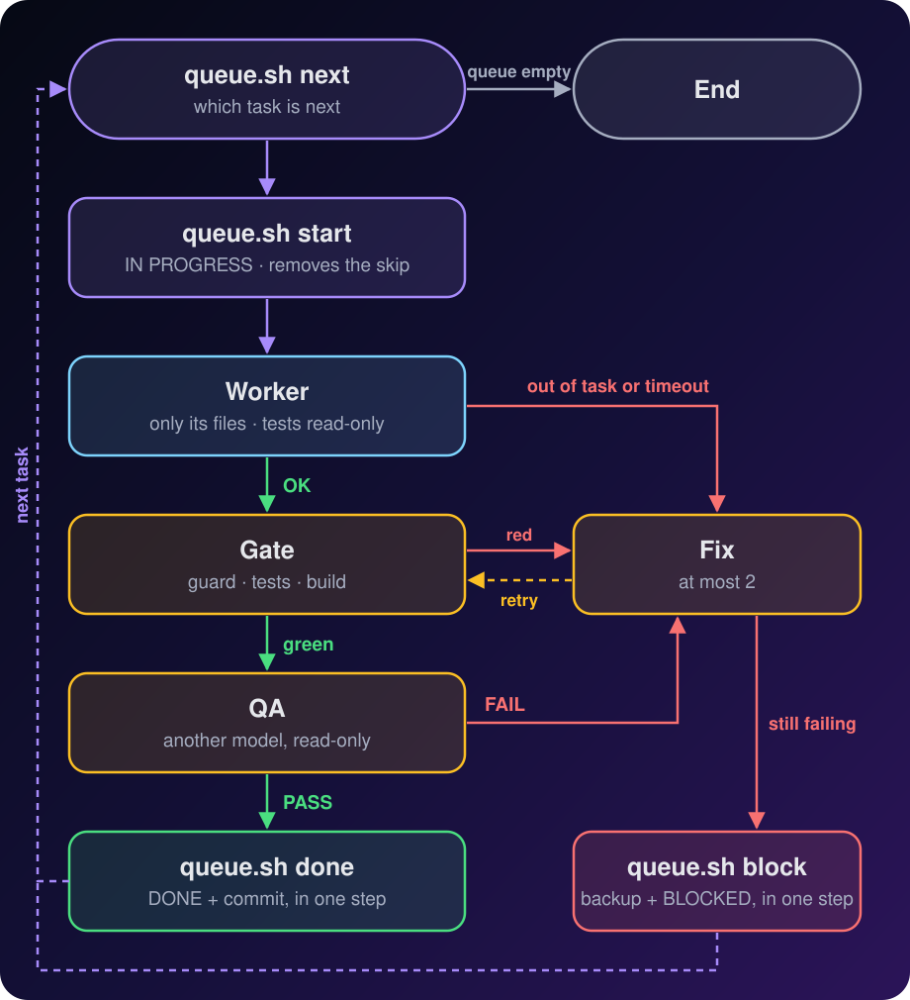

<p align="center">
  <b>English</b> · <a href="README.es.md">Español</a>
</p>

<p align="center">
  
</p>

<h3 align="center">
  Tell your agent an idea. It asks just the right questions, sets up the project<br/>
  and leaves a team of agents building it while you do something else.
</h3>

<p align="center">
  <a href="CHANGELOG.md"></a>
  
  <a href="https://github.com/Aresdgi/unattended-dev/actions/workflows/test.yml"></a>
  <a href="#license"></a>
  <br/>
  
  
  
  
</p>

<p align="center">
  
  <br/>
  <sub>Example session</sub>
</p>

> [!WARNING]
> **Experimental.** The scripts are tested on Linux and macOS (see
> [Testing](#-testing)), but full unattended runs have only been tried on a
> few small projects. Review what it builds before you trust it.
>
> **Where it pays off:** long queues of CLIs, libraries and well-bounded
> features that work for hours or overnight. **Where it doesn't:**
> milestones of a few tasks (a normal session with `/goal` is faster, and
> the skill tells you so), UIs whose design is still to be found, and
> products with open decisions.

> [!NOTE]
> **Formerly `modo-desatendido`**, in the `aresdgi` marketplace. If you
> installed it that way, it moves to the new name by itself: in Claude
> Code run once
>
> ```text
> /plugin marketplace update aresdgi
> /plugin install unattended-dev@aresdgi
> ```

## 🚀 Try it in 10 seconds

**Claude Code**

```text
/plugin marketplace add Aresdgi/unattended-dev
/plugin install unattended-dev@unattended-dev
```

**Codex, opencode and other agents**

```sh
npx skills add Aresdgi/unattended-dev -g -a codex opencode
```

**Or let your agent do it.** Paste this into Claude Code, Codex, opencode or
any agent with a terminal:

```text
Install the unattended-dev skill from https://github.com/Aresdgi/unattended-dev
```

Then just say: *"I want to build…"*. More options in [Installation](#-installation).

## 💜 Why it's good

<table>
<tr>
<td width="50%" valign="top">

### 🧠 An interview that leaves no gaps

It only asks what it needs, with options and its recommendation first.
Whatever you don't care about, it decides and marks *"(default)"*.

</td>
<td width="50%" valign="top">

### 🛡️ Tests that are hard to cheat

They are written by someone who doesn't implement, workers get them
read-only, and a guard in the gate catches the usual tricks: changing an
assertion, re-adding a skip, deleting a test.

</td>
</tr>
<tr>
<td valign="top">

### 🎛️ Your team, your models

Claude, Codex, opencode… It only offers what you have installed, and you
choose who orchestrates, who implements and who reviews.

</td>
<td valign="top">

### 🌙 It launches itself

You answer the questions and say "yes" once. It prepares everything and
leaves the orchestrator working in the background, with the Mac kept
awake. You can leave right after that "yes".

</td>
</tr>
<tr>
<td valign="top">

### 🔁 If it stops, it resumes

All the state lives in files. If the quota runs out or the laptop goes to
sleep, relaunch it and it picks up where it left off.

</td>
<td valign="top">

### 🔒 Nothing irreversible without you

Push, deployments, deletions and real data stay out of the queue. Those
are done with you watching.

</td>
</tr>
<tr>
<td valign="top">

### 🧭 It doesn't stop at every doubt

The interview asks up front for the limits and edge cases, with a
recommendation, and you settle them in one round. If a gap still shows up
later, it picks the most prudent option, writes it in
`docs/DECISIONES.md` and keeps going.

</td>
<td valign="top">

### 🗒️ Everything is written down

Starts, fixes, decisions and blocks go into `docs/LOG.md` by themselves,
along with when the preparation started and when the queue was launched,
and the orchestrator reports to you in your language.

</td>
</tr>
</table>

> [!TIP]
> What works is not ceremony. It's four things: **small verifiable tasks**,
> **tests written first and protected**, **QA not done by whoever
> implemented** and **state kept in files** so work can resume. Everything
> else, the minimum.

## 🧭 How it works

<p align="center">
  
</p>

| | Phase | What happens |
| :-: | --- | --- |
| 1 | **Interview** | At most 4 questions per round, with options and a recommendation: the idea, limits and edge cases, the team (or "the usual"), the hours and how to launch |
| 2 | **Confirmation** | One summary with the tasks, their files and risk, and "shall I set it up and leave it running?". The last question |
| 3 | **Phase zero** | On its own: skeleton, gate, skipped acceptance tests, `AGENTS.md` and `ORQUESTADOR.md`. Smoke test and dry run only if this machine hasn't passed them yet |
| 4 | **Launch** | On its own too: the orchestrator in the background, in a new session with a clean context |
| 5 | **Review** | When you're back, say "review the session": first what was decided without you, then the queue, the guard, the gate and a manual test |

The preparation, from the first question to the queue running, has a
budget: **5 minutes and no worker calls** for 1 to 3 tasks, **15 minutes
and at most one** for 4 to 8, **30 minutes** for more or in full mode.
What doesn't fit is done once per machine or moved to the queue.

### Each task in the queue

The orchestrator **coordinates, it doesn't implement**: while a task goes
well it works from what the scripts hand back, not from the code. From the
first failure it may read the task's diff and the failing test, to give
the worker a concrete fix order; it never edits code itself.

<p align="center">
  
</p>

- **Gate**: test guard, typecheck, tests and build, in
  `.desatendido/gate.sh`. It runs before the QA, so no review is spent on
  code that is going to change, and `queue.sh done` runs it again itself
  before closing.
- **QA**: read-only, by the task's risk. Low risk: one *combined* review.
  High risk: *fidelity* (does what the SPEC asks, nothing invented) and
  *technical* (bugs, edge cases, security) apart. Plus *design* (mobile
  and desktop screenshots, empty and error states, accessibility) if it
  touches the UI.

If the session gets cut off (quota, laptop asleep…), launch it again the
same way: the half-done work of the task left IN PROGRESS goes to a backup
branch and that task starts again from a clean state.

## 🌙 Automatic launch

How to launch is asked in the interview, and once phase zero is done it
launches without asking again. It picks the mechanism for your
orchestrator and, the first time on your machine, runs a **dry run** with a
trivial goal (the launched orchestrator starts a test worker and releases
it, to test the whole chain). After that it is recorded, and it only checks
that the launch started.

| Orchestrator | How it launches | How to watch | How to stop |
| --- | --- | --- | --- |
| **Claude Code** | `claude --bg` with the model, the permission mode and the `/goal` | `claude agents`, `claude attach <id>`, `claude logs <id>` | `claude stop <id>` |
| **`/goal` but no background mode** (Codex) | Detached tmux session, `/goal` typed with `tmux send-keys` | `tmux attach -t ud-<project>` | `tmux kill-session -t ud-<project>` |
| **No `/goal`** | `.desatendido/bucle.sh` with `nohup` | `tail -f logs/bucle-*.log` | `touch AGENT_STOP` |
| **Workers through Orca** | Orca tab with `orca terminal create` | The tab in Orca | `orca terminal close` |

- Always with **`caffeinate`** so the Mac doesn't sleep while it runs. Keep
  it plugged in: on battery with the lid closed it will sleep anyway.
- The `/goal` only asks for an **end state**: the queue has no PENDING
  tasks and the gate passes, the orchestrator had to stop and said why,
  or the hours you chose are up. Mistakes along the way go in the final
  report and never keep it turning.
- A **time fuse** stops the session at the end of those hours even if the
  goal never ends. If you say "no limit", it stays as a safety net at 24
  hours.
- If tmux isn't installed, it **asks for permission** in the interview,
  before installing it.
- The Orca CLI only works inside an Orca terminal. So if the workers go
  through Orca, the orchestrator starts in an Orca tab. If Orca can't be
  used, it **stops and asks you**; it never switches launcher on its own.
- If you'd rather launch it yourself, say so in the interview and you get
  `LANZAR.md` filled in.

## ⚡ Two modes

| | 🏎️ Fast · *default* | 🏗️ Full |
| --- | --- | --- |
| **When** | 8 tasks or fewer and nothing risky | More than 8 tasks, real data, high risk or because you ask |
| **Interview** | 1 or 2 rounds | As many as needed |
| **You** | Answer and confirm once | The same |
| **Acceptance tests** | Written by whoever prepares, checked against the stubs | Written by QA, checked against a reference implementation |
| **Documents** | `docs/SPEC.md` and `PLAN.md` | SPEC, one file per task and one closing note per task |
| **Preparation** | 5 minutes (1 to 3 tasks) or 15 (4 to 8) | Up to 30 minutes |

With 3 tasks or fewer it first tells you that a normal session does it
sooner. During the interview it proposes a mode, in one line and with the
reason.

## 🎛️ Your team, your rules

There's no fixed team. Before asking, the skill checks what you have
installed (Claude Code, Codex, opencode, Gemini, Orca, tmux…), which models
each one accepts and whether it has `/goal` and a background mode, and
**only offers that**.

| Role | What it does |
| --- | --- |
| 🎼 **Orchestrator** | Hands out the queue (through `queue.sh`, which keeps `STATUS.md`), runs the gate and decides the fixes |
| 🛠️ **Implements** | Does each task and its fixes |
| 🎨 **Design** | The UI tasks, if any. Can be the same as implements |
| 🔍 **QA** | Reviews read-only. Ideally a different provider from the implementer |

Each role is taken by the tool and model you say, even if it's not the most
efficient: it warns you once with the reason (QA with the same model that
implements, an expensive model on mechanical tasks, the whole team on the
same quota…) and does what you say.

If you want, it saves it as "the usual" in
`~/.config/modo-desatendido/equipo.md`, and next time it's the first option:

```markdown
- Orchestrator: claude / opus
- Implements: opencode / <provider/model>
- Design: same as implements
- QA: codex / <model>
- Worker launcher: cli
```

A **smoke test**, once per machine: each role answers
`OK <exact model name>`. It's recorded in that same file with the date
and repeated when the team changes or after 7 days. When there's no
recent one, the orchestrator checks the model of the first worker of
each role.

The skill always talks to you in your language.

## 🧰 Included scripts

Phase zero copies five scripts to `.desatendido/` in your project. They
work with any tool and on macOS without installing anything. They detect
problems after the fact and make the mechanical decisions; they are not a
sandbox.

<table>
<tr>
<td width="25%" valign="top">

#### 🚀 `lanzar-worker.sh`

Launches any worker with a **time limit**, a **full log** in `logs/` and
only the last 30 lines of output. Can make the tests **read-only** while it
runs, and flags any file touched outside its task, **committed or not**.

</td>
<td width="25%" valign="top">

#### 🛡️ `guardia-tests.sh`

Goes inside the gate. **Fails** if someone changes an acceptance test in
anything other than removing the skip, adds a new skip, deletes or creates
tests, or marks a task done while its test is still skipped.

</td>
<td width="25%" valign="top">

#### 📋 `queue.sh`

Makes the **mechanical decisions** in code, not in the model: the next
task, dependencies, BLOCKED propagation, removing the skip when a task
starts, **closing** a task in one atomic step and **recovering** a task
that was cut off. Each task is measured against the commit it started
from: `done` refuses if it touched files outside its list, if the gate
fails or if there is no QA PASS, of the kind its risk asks for, for the
exact code being closed. Every state change is committed.

</td>
<td width="25%" valign="top">

#### 🔁 `bucle.sh`

Keeps the orchestrator alive if its tool has no native goal: one task per
round, chosen by `queue.sh`, with a clean context, until the queue is empty
or the hour limit is reached. A round that hangs is cut off.

</td>
</tr>
</table>

And **`vigilar-worker.sh`**: the same protections as `lanzar-worker.sh`
(tests and `.desatendido/` read-only, files touched outside the task) in two steps, `begin`
and `end`, for workers that start and finish on their own, such as Orca
workers.

<details>
<summary><b>Usage and exit codes</b></summary>

```zsh
# The queue: next task, start it (removes the skip of its test), finish it
.desatendido/queue.sh next            # -> T01
.desatendido/queue.sh start T01
.desatendido/queue.sh qa T01 combined PASS "summary"  # QA verdict for the code as it is now
.desatendido/queue.sh done T01 "summary"    # checks, then DONE + commit, in one step
.desatendido/queue.sh block T01 "reason"    # backup branch + files back + BLOCKED, in one step
.desatendido/queue.sh fix T01 "reason"      # counts a fix; exit 5 when none are left
.desatendido/queue.sh decide T01 "rule"     # records a default decision, +1 fix
.desatendido/queue.sh note "text"           # a free line in the Log
.desatendido/queue.sh outside T01           # files out of the task since it started
.desatendido/queue.sh restore-outside T01   # puts them back (a copy stays in a branch)

# A worker, with its allowed files and the tests read-only
.desatendido/lanzar-worker.sh implements T01 \
  --allowed "src/dni.ts" --readonly "tests/acceptance" -- \
  opencode run -m <provider/model> "Implement task T01 of PLAN.md…"

# The gate (.desatendido/gate.sh) starts with the guard, watching the started and DONE tasks
.desatendido/guardia-tests.sh fase-cero tests/acceptance $(.desatendido/queue.sh tests) \
  && npm run typecheck && npm test && npm run build

# The external loop: 4 hours max, 1 hour per round, and a clean stop
MAX_HOURS=4 ROUND_TIMEOUT=3600 .desatendido/bucle.sh
touch AGENT_STOP   # stops at the end of the current round
```

| `lanzar-worker.sh` exits with | Meaning |
| :-: | --- |
| `0` | Finished fine and touched nothing outside what's allowed |
| `3` | **OUT OF TASK**: touched files that weren't allowed |
| `124` | **TIMEOUT**: went over the limit (20 minutes by default) |
| `128+N` | **KILLED**: the worker was stopped by signal N |

| `queue.sh` exits with | Meaning |
| :-: | --- |
| `3` | Wrong usage or state: for example `start` with a dependency not DONE or another task IN PROGRESS |
| `4` | A git step failed; nothing was marked |
| `5` | No fixes or decisions left: block the task |
| `6` | Files outside the task since it started (`outside`, `done`). Also `fix`, `decide`, `note`, `qa` and `set` when `STATUS.md`, `docs/LOG.md` or `docs/DECISIONES.md` has changes `queue.sh` did not make |
| `7` | `done`: the gate failed (it prints the last 20 lines) or changed files (they are put back) |
| `8` | `done`: no QA PASS of each type the task needs (by its risk) for the code as it is now |

Only `done` runs the project's git hooks. Every other commit of
`queue.sh` runs none (`--no-verify`, and not even `prepare-commit-msg`):
it only carries `STATUS.md`,
`docs/LOG.md` or `docs/DECISIONES.md`, or it puts the tree back (`block`,
`recover`, `restore-outside`), and a failing hook must never leave the
queue stuck right when it is trying to recover.

`bucle.sh` recovers any task left IN PROGRESS before starting, and stops by
itself if the queue is empty, if no task can start, if `AGENT_STOP` exists,
if it goes over `MAX_ROUNDS` or `MAX_HOURS`, or if a round ends without its
task being DONE or BLOCKED. A round that goes over `ROUND_TIMEOUT` (or the
time left of `MAX_HOURS`) is cut off, its task goes back to PENDING and the
loop stops with 124.

</details>

## 🧪 Testing

The scripts have their own test suite, run on Linux and macOS on every push:

```zsh
bash tests/run.sh
```

It covers the cheats found in review (an assertion deleted together with a
skip, a forbidden file changed and committed, a worker killed by a signal),
queue recovery when a session is cut off, the queue state surviving a block
or a git step that fails, and your own changes never ending up inside a
task. Also a change out of task that survives a fix, a worker that commits
broken code before a block, a `done` with no gate or QA, a QA PASS for
code that changed afterwards, a round that hangs, a high risk task with a
single combined review, a worker that edits the Log and a project hook
that fails while the queue puts a task back.

## 📁 What it leaves in your project

```text
my-project/
├── .desatendido/            the scripts above, gate.sh, the allowed files and the QA of each task
├── docs/
│   ├── SPEC.md              1 or 2 pages: what it does, inputs, errors, limits
│   ├── LOG.md               the Log: preparation, starts, fixes, QA, DONE, BLOCKED
│   ├── DECISIONES.md        what was decided without you, if anything
│   ├── tareas/Txx.md        full mode only
│   └── cierres/             full mode only
├── tests/acceptance/        one per task, skipped, written by whoever doesn't implement
├── AGENTS.md                conventions (CLAUDE.md is a link to it)
├── ORQUESTADOR.md           rules and real commands for each role
├── PLAN.md                  tasks with signature, allowed files and cases
└── STATUS.md                the queue: PENDING · IN PROGRESS · DONE · BLOCKED
```

Everything goes into a `fase cero` commit with the `fase-cero` tag, which
is the reference the guard compares the tests against. During the queue,
the work of a blocked or interrupted task is kept in a
`queue/backup/<task>-<date>` branch.

## 🔒 Safety rules

They always apply, whatever the team or the mode:

> [!IMPORTANT]
> - **Nothing irreversible in the queue.** Real data, deletions,
>   deployments, publishing or push are done with you watching.
> - **No safety net, no launch.** It needs verified acceptance tests and
>   the guard in the gate. The smoke test and the launch dry run pass
>   once per machine; until they do, the queue checks the first worker of
>   each role and the launch is checked to have started.
> - **Nothing is decided silently.** Gaps are asked about until you
>   confirm. After that, in phase zero and in the queue, they follow the
>   autonomy you chose: *proactive* (default) records a prudent rule in
>   `docs/DECISIONES.md` and keeps going, *conservative* stops with the
>   question. Anything that changes what the product does is always left
>   to you.
> - **Credentials never go into the queue**, and no `.env`, keys or logs
>   in the commits.
> - **The queue only commits its own work.** A task won't start while the
>   folder has changes that aren't from the queue. To keep working on the
>   repo meanwhile, use a worktree of your own (`git worktree add`).

## 📦 Installation

### Claude Code

```text
/plugin marketplace add Aresdgi/unattended-dev
/plugin install unattended-dev@unattended-dev
```

To update: `/plugin marketplace update unattended-dev`. It is also in my plugin
catalog, [Aresdgi/claude-plugins](https://github.com/Aresdgi/claude-plugins), as
`unattended-dev@aresdgi`.

### Codex, opencode and other agents

With [skills](https://www.npmjs.com/package/skills), which finds the skill
in `skills/unattended-dev`:

```sh
npx skills add Aresdgi/unattended-dev -g -a codex opencode
```

`-g` installs it for your user and `-a` picks the agents (`-a '*'` for all
the supported ones). To update: `npx skills update unattended-dev`.

<details>
<summary><b>By hand, with git</b></summary>

<br/>

```sh
git clone https://github.com/Aresdgi/unattended-dev.git ~/unattended-dev
mkdir -p ~/.agents/skills
ln -s ~/unattended-dev/skills/unattended-dev ~/.agents/skills/unattended-dev
```

To update: `git -C ~/unattended-dev pull`.

</details>

### 🤖 For agents

If a user asked you to install this skill, follow these steps for the tool
you are running in. Ask before running anything if your permissions require
it.

1. **Claude Code**: run in the shell
   ```sh
   claude plugin marketplace add Aresdgi/unattended-dev
   claude plugin install unattended-dev@unattended-dev
   ```
   Then tell the user to run `/reload-plugins` or start a new session.
2. **Codex, opencode or another agent, with Node.js available**: run
   ```sh
   npx skills add Aresdgi/unattended-dev -g -a <agent> -y
   ```
   with `<agent>` being `codex`, `opencode` or your own id (`-a '*'` for
   every supported agent).
3. **Without Node.js**: clone the repo and link the skill folder into the
   skills directory your tool reads (`~/.agents/skills` for Codex and
   opencode, `~/.claude/skills` for Claude Code):
   ```sh
   git clone https://github.com/Aresdgi/unattended-dev.git ~/unattended-dev
   mkdir -p ~/.agents/skills
   ln -s ~/unattended-dev/skills/unattended-dev ~/.agents/skills/unattended-dev
   ```

Check that `SKILL.md` is in the installed folder, then tell the user it is
ready and that a new session picks it up. It triggers with "I want to
build…" or "unattended mode".

> [!TIP]
> Works in any agent that reads `SKILL.md`. If your tool has questions with
> options, it uses them; if not, it gives you numbered options.

## 💬 How to use it

Just talk, in English or Spanish. It triggers with phrases like:

> *"I want to build…"* · *"set up the project"* · *"make it build itself"*
> · *"unattended mode"* · *"overnight mode"* · *"leave it running"* · *"launch it"*
> · *"quiero hacer…"* · *"déjalo picando"*

In Claude Code you can also call it directly with
`/unattended-dev:unattended-dev`.

When you're back, in the same session where you prepared it, say **"review
the session"**: it checks the state of the queue, that the tests are still
intact, the gate and a manual test with known results, and leaves you a
table with tasks done, QA failures, duration and usage of each plan.

<details>
<summary><b>What about an existing repo?</b></summary>

<br/>

Same, but the interview only covers the milestone, no skeleton is created
and the tag is `<milestone>-start`. If there's already a general SPEC, the
milestone's goes in `docs/hitos/<milestone>/`. If it finds leftovers from
old versions (`desatendido.sh`, `DESATENDIDO.md`, a `bucle.sh` at the root),
it proposes deleting them and waits for your OK.

</details>

<details>
<summary><b>What if a task doesn't work out?</b></summary>

<br/>

It gets two fix attempts, counted by `queue.sh`. If the problem is a gap in
the SPEC and autonomy is proactive, it records a prudent rule in
`docs/DECISIONES.md`, which earns one more fix. If it still fails, it's
marked **BLOCKED** with the reason in the Log, its work is saved in a
`queue/backup/` branch (its files go back to how they were before the
task, even what the worker committed) and the orchestrator moves on to the
next one. Tasks that
depended on it are blocked too. In the review you go through the decisions
first, and it proposes whether to fix the task, the SPEC or the tests,
supervised.

</details>

<details>
<summary><b>Can the orchestrator change the tests to make them pass?</b></summary>

<br/>

It's forbidden, and made hard on purpose: workers get the tests and the
scripts in `.desatendido/` read-only, `queue.sh` is the one that removes
the skip, and the guard checks every gate, so changing an assertion,
adding a skip or deleting a test fails it. A QA PASS only counts for the
code it reviewed, and `queue.sh done` runs the gate itself.
The scripts catch the usual tricks; they are not a sandbox, which is why
the review at the end checks the tests again.

</details>

<details>
<summary><b>Do I need Orca or tmux?</b></summary>

<br/>

No. By default workers are launched through the CLI with `lanzar-worker.sh`,
and with Claude Code as the orchestrator `claude --bg` is enough. Orca is
optional, if you want to see each worker in its own tab. In that mode the
orchestrator follows Orca's own orchestration guide, reuses the
implementer's tab for fixes, closes each tab with `worker-release` as soon
as it's no longer needed and checks at the end that none is left, with the
same protections as the CLI (`vigilar-worker.sh`). tmux is only needed if
the orchestrator has `/goal` but no background mode, like Codex.

</details>

## 📜 Changelog

What changed in each version, from the first one (as `modo-nocturno`), is
in [CHANGELOG.md](CHANGELOG.md). Every public version also has its
[release](https://github.com/Aresdgi/unattended-dev/releases): on GitHub,
**Watch → Custom → Releases** to get notified of new ones.

## License

MIT

<div align="center">
<sub>Made by <a href="https://github.com/Aresdgi">Aresdgi</a> · to leave it running 🌙</sub>
</div>
